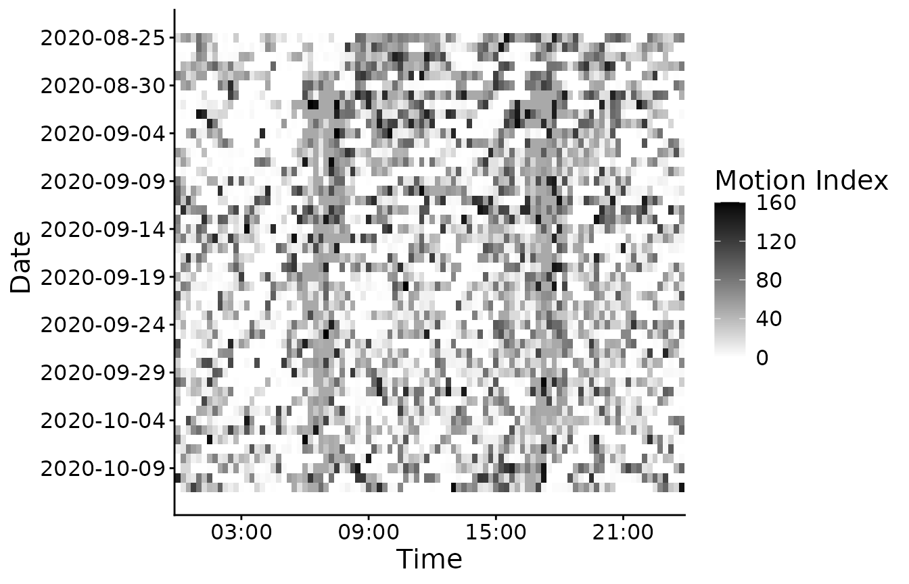
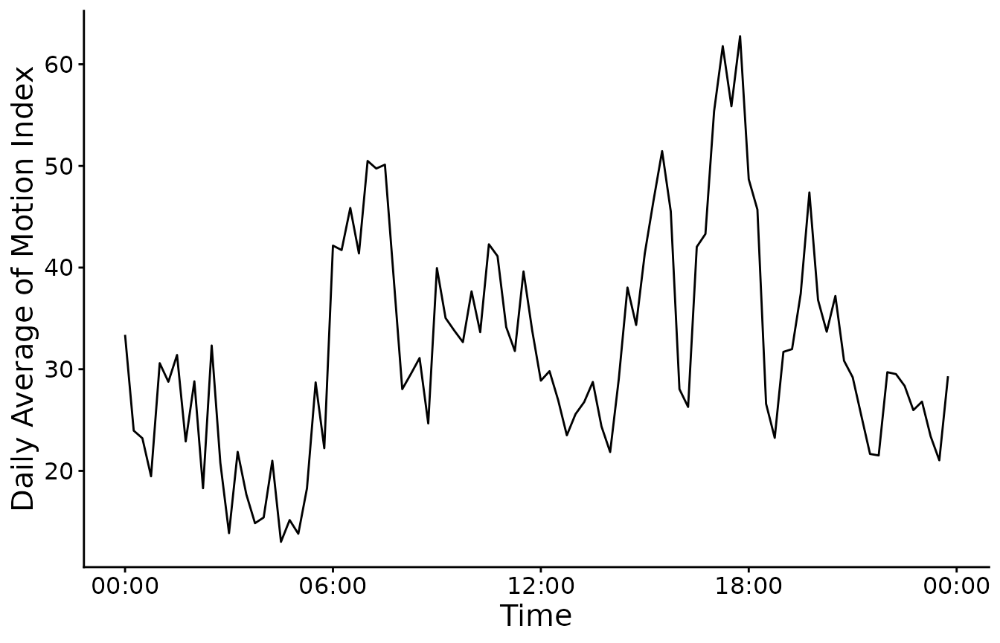
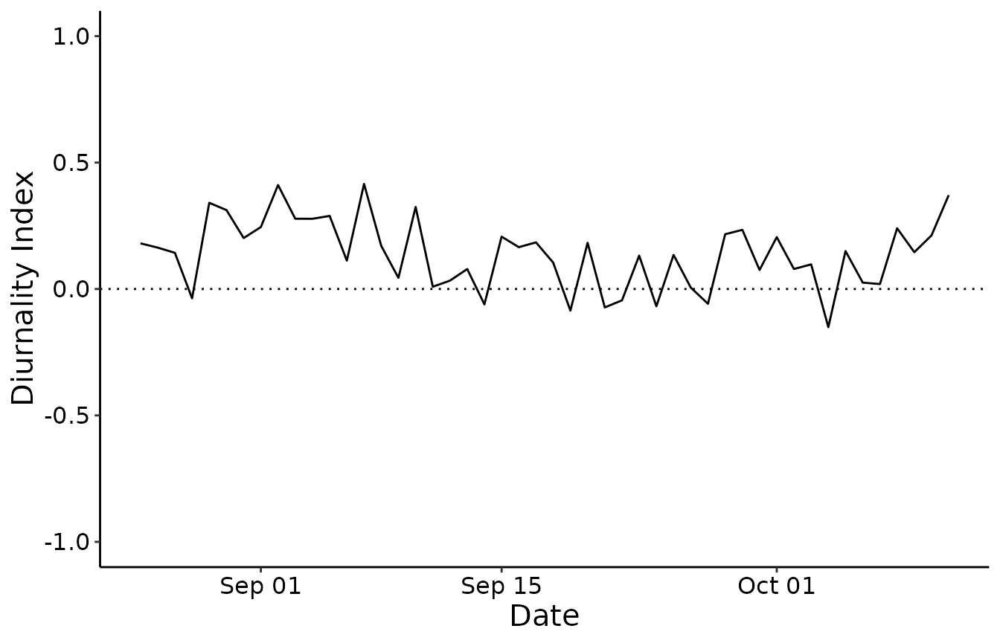

# Visualizing actograms, average activity and diurnality index

The three most commonly used tools to perform a first inspection on
activity data are:

- Actograms: These are 2D graphs that show tiled (15 min per tile)
  activity during 24h period over several days. These graphs are useful
  to visualize daily cycles of activities. In actograms, the x-axis
  represent the day time, the y-axis represent the day and the intensity
  of the colors represents the activity amplitude.

- Average activity plots: These graphs show the average (arithmetic
  mean) activity for a specific moment of the day. The average is done
  over all days taking one data point from each day and averaging all
  the values.

- Diurnality index: This type of graphs show whether the activity tends
  to be more diurnal or nocturnal. In another word, this shows whether
  the subject of the study is more active during the day or during the
  night. The value ranges from -1 to +1. Whereas -1 means a completely
  nocturnal activity and +1 means a comletely diurnal activity. Animal’s
  result with balanced day and night activity is 0.

We start by loading a dataset from the library digiRhythm, we then
remove the outliers and resample it to 15 min. We choose one activity to
study.

``` r
library(digiRhythm)
data <- digiRhythm::df691b_1
data <- remove_activity_outliers(data)
data <- resample_dgm(data, 15)
activity <- names(data)[2]
head(data)
#>              datetime Motion.Index Steps
#> 1 2020-08-25 00:00:00           20     8
#> 2 2020-08-25 00:15:00           52    46
#> 3 2020-08-25 00:30:00           61    39
#> 4 2020-08-25 00:45:00           29    18
#> 5 2020-08-25 01:00:00           83    26
#> 6 2020-08-25 01:15:00           50    23
```

## Actograms

We then proceed to plot the actogram of the activity. We can choose the
start and end date of the actogram. We can also choose an alias for the
activity. This alias is used for aesthetics purpose in the plots. For
instance, if the name of the activity column is motion.index, we don’t
probably want to show this string in the plot’s legend, but rather have
it coded properly as ‘Motion Index’. The actogram function also offers
the possibility to save the graph directly in a path as shown in the
commented line below. Users only provide the path (relative or physical)
without the file name ignoring the extension. All pictures in digiRhythm
are saved with the tiff format as it’s the most widely used extension
for scientific publications.

User have the possibility to save the plot with another extension or
configuration simply by saving the actogram object in a variable (which
is a ggplot object) and control it as they wish to. User could
additionally use this actogram object to work on the calculated data.

``` r
start <- "2020-08-25" # year-month-day
end <- "2020-10-11" # year-month-day -->
activity_alias <- "Motion Index"
# save <- 'sample_results/actogram' #if NULL, don't save the image
my_actogram <- actogram(data, activity, activity_alias, start, end, save = NULL)
#> Warning: The `size` argument of `element_line()` is deprecated as of ggplot2 3.4.0.
#> ℹ Please use the `linewidth` argument instead.
#> ℹ The deprecated feature was likely used in the digiRhythm package.
#>   Please report the issue to the authors.
#> This warning is displayed once per session.
#> Call `lifecycle::last_lifecycle_warnings()` to see where this warning was
#> generated.
```



## Average Activity

Now, we plot the average activity. We follow the same dataframe and same
logic like for the actograms. And user could use the resulted object as
the actogram object.

``` r
start <- "2020-08-25" # year-month-day
end <- "2020-10-11" # year-month-day -->
activity_alias <- "Motion Index"
# save <- 'sample_results/actogram' #if NULL, don't save the image
my_daa <- daily_average_activity(data, activity,
  activity_alias,
  start,
  end,
  save = NULL
)
```



## Diurnality Index

The diurnality index could be computed and plotted using the diurnality
function as follows. The user has the opportunity to change day- and
night-time. The default daytime is 06:30 to 16:30. Default night-time
occurred from 18:00 to 05:00. The user can adapt the time to lighttime
or exclude some management times of the animals. Management times are
periods when humans influence the activity of the animal, so that it is
not possible to realize their own activity (for excample milking time in
dairy cows). As the actogram function it offers the possibility to save
the graph directly or using the ggplot object to configurate a different
plot or work on the calculated data.

``` r
day_time <- c("06:30:00", "16:30:00")
night_time <- c("18:00:00", "T05:00:00")
my_di <- diurnality(data, activity, day_time, night_time, save = NULL)
```


