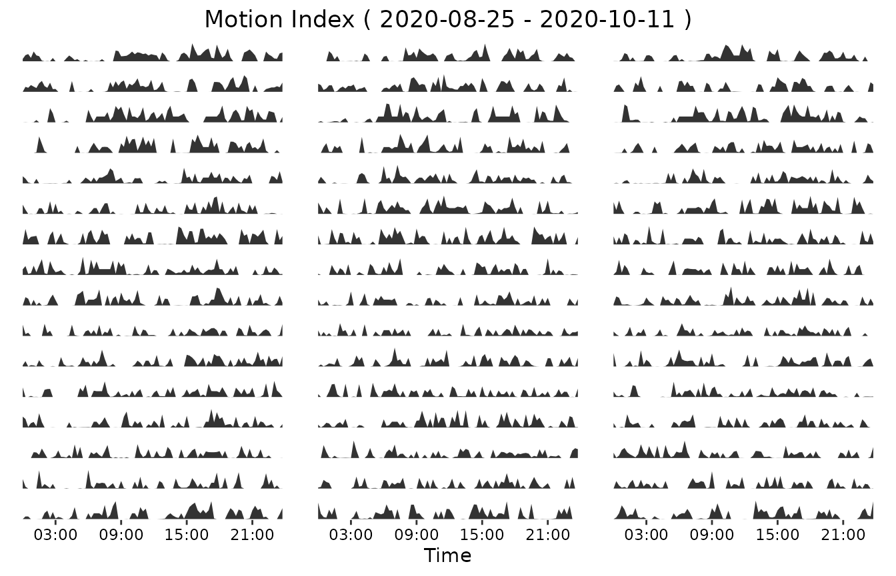

# Further options of visualization in DigiRhythm

DigiRhythm additionally contains some deeper visualization
possibilities. - the function daily_activity_wrap_plot could be used to
visualize the activity over time per day - the function plot_quadro is a
possibility to combine different forms of visualizing activity
(actogram, average activity, DFC and HP and daily activity) - the
function plot_actogram_avg_activity will show what happens, if Hassan
wrote the code

First, we start by loading a dataset, removing the outliers, resample it
to 15 min and choose the activity to study.

``` r
library(digiRhythm)
data <- digiRhythm::df691b_1
data <- remove_activity_outliers(data)
data <- resample_dgm(data, 15)
activity <- names(data)[2]
head(data)
#>              datetime Motion.Index Steps
#> 1 2020-08-25 00:00:00           20     8
#> 2 2020-08-25 00:15:00           52    46
#> 3 2020-08-25 00:30:00           61    39
#> 4 2020-08-25 00:45:00           29    18
#> 5 2020-08-25 01:00:00           83    26
#> 6 2020-08-25 01:15:00           50    23
```

## Daily Activity Wrap

Now we proceed to plot the daily activity. User can decide to plot the
activity during the time of one day. Or to plot a huge plot including a
number of day-plots. User has to define the activity to plot.
Additionally, user has to define the activity_alias, similar to the
actogram. Start and end date have to be defined by the user, using the
format “%Y-%m-%d”. Afterwards, sampling_rate of the data has to be
defined. The sample size has to be bigger or equal to the sample size of
the dataset. With “n_cols”, the user is able to decide how many
graphs/days should be shown in a row of the plot. User has the
possibility to save the plot directly, using this function.

``` r
activity_alias <- "Motion Index"
start <- "2020-08-25" # year-month-day
end <- "2020-10-11" # year-month-day
sampling_rate <- 15
ncols <- 3 # number of columns
# save <- 'sample_results/daily_wrap_plot' #if Null, doesn't save the image
my_daily_wrap_plot <- daily_activity_wrap_plot(data, activity,
  activity_alias,
  start,
  end,
  sampling_rate,
  ncols,
  save = Null
)
```


